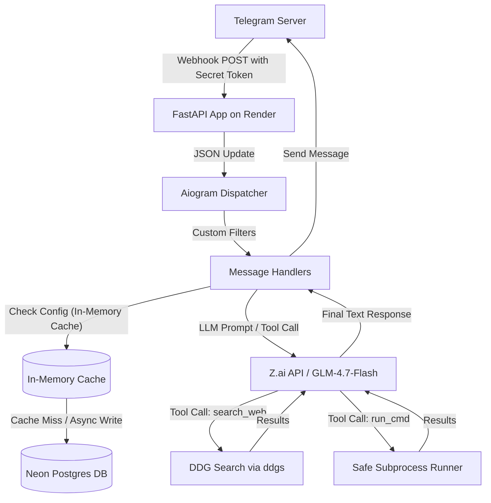

# Research Findings & Implementation Plan: Telegram AI Agent Bot

This document outlines the comprehensive research, technical evaluation, stack recommendations, and a concrete step-by-step implementation plan for building a group-chat capable Telegram AI Agent Bot in Python (intended for deployment in 2026).

---

## 1. Executive Summary

We are designing a robust, modern Telegram AI bot that acts as a group-chat companion. The bot will feature:
*   An **emergent, casual, sarcastic personality** that feels human-like rather than robotic.
*   A **conversational brain** powered exclusively by Zhipu AI (Z.ai) **GLM-4.7-Flash** (free tier), with native tool-calling support.
*   **Self-contained web search capabilities** via DuckDuckGo (using the updated `ddgs` package) exposed as a tool for the agent.
*   A **secure shell command runner** restricted via strict executable whitelisting and regex-based argument validation, executed without a shell parser to prevent command injection.
*   **Per-chat toggles** between *Mention-Only* and *Free-Reply* modes, enforced via custom filters.
*   **A serverless PostgreSQL backend (Neon)** paired with a **Write-Through In-Memory Caching Architecture** (async background writes) to minimize latency and prevent exhausting Neon's 100 CU-hours free quota.
*   A **webhook-based deployment** on Render’s Free Tier, using FastAPI to manage lifecycle and receive events, with an optional keep-alive ping system that targets a DB-free route to prevent Render container sleep while allowing Neon to scale to zero.

---

## 2. Technical Stack & Architecture



### Stack Components
*   **Language**: Python 3.11+
*   **Bot Framework**: `aiogram 3.x` (native async, router-based, high performance)
*   **Web Framework**: `FastAPI` (for Webhook management, lifecycle, and health endpoints)
*   **LLM SDK**: `zai-sdk` (Official Z.ai Python SDK)
*   **Search Package**: `ddgs` (renamed from `duckduckgo-search`)
*   **Database**: `Neon PostgreSQL` (Serverless, free-tier, SQL-compatible via `SQLAlchemy` + `asyncpg`) + In-memory cache (`dict` + `collections.deque`)
*   **Server/Hosting**: `Render` Web Service (Free tier, with optional UptimeRobot keep-alive pinging a DB-free `/health` endpoint)

---

## 3. Detailed Research Findings

### 1. Bot Framework: aiogram vs. python-telegram-bot vs. Telethon
*   **aiogram (Recommended)**: Built from the ground up for `asyncio`. It is exceptionally fast and uses a modern "Magic Filter" syntax (`F`) that allows writing very concise routing logic. Its structure uses modular `Router` objects, which makes scaling codebases clean.
*   **python-telegram-bot (PTB)**: A highly mature, object-oriented library. Extremely stable and robust. However, for modern, high-concurrency group chat environments, `aiogram` is generally preferred by developers in 2026 due to its lower overhead and native async-first design.
*   **Telethon**: Interacts with the MTProto API rather than the Bot API. Used for creating custom Telegram clients or "userbots" (operating on a personal user account). Unless you need capabilities restricted to user accounts (like scraping chats the bot is not in), Telethon is unnecessary, overly complex, and carries account suspension risks.
*   **Mention-Detection**: In `aiogram`, we can easily inspect `message.entities` for `mention` and `text_mention` elements, check if the bot username is part of the text, or detect if `message.reply_to_message.from_user.id` matches the bot's own ID.

### 2. Conversational Brain: Z.ai API (GLM-4.7-Flash Free Tier)
*   **Model Details**: `glm-4.7-flash` is Zhipu AI's permanently free flagship-lite model.
*   **Free Tier Rate Limits & Quotas**:
    *   **Total Tokens**: Unlimited (no monthly or daily token caps).
    *   **Concurrency**: Crucially, the free tier is rate-limited primarily by concurrency, typically restricted to **1 to 2 concurrent requests (QPS)** depending on the account tier, with potential platform limits up to 30 QPS.
    *   **Error Codes**: Exceeding the concurrency limit returns HTTP `429` (Error code `1302` for rate limit or `1305` for platform overload/throttling during peak periods).
*   **Tool / Function Calling Support**:
    *   **Confirmed**: `glm-4.7-flash` natively supports function calling. It is fully capable of generating structured tool arguments for `search_web` and `run_command`.
    *   **Reliability Tip**: For function calling, Zhipu recommends adjusting LLM hyperparameters to `temperature=0.7` and `top_p=1.0` (as opposed to 1.0/0.95 for general conversation) to maximize tool-calling structure stability.
*   **Mitigation Strategy for Free Tier Concurrency Limits**:
    1.  **Exponential Backoff Retries**: Wrap all API calls in a retry handler that catches `429` errors and sleeps with backoff (e.g., 1s, 2s, 4s).
    2.  **Concurrency Lock**: Implement an `asyncio.Semaphore(1)` in the bot to serialize calls to Zhipu AI. This queues overlapping messages from group chats rather than sending concurrent API requests, preventing `429` errors entirely at the cost of a slight reply queue delay for spammed chats.
    3.  **Fallback Configuration**: Keep the model name parameterized as an environment variable (`MODEL_NAME=glm-4.7-flash`). If the free tier's peak hour queue throttling becomes an issue, the user can easily swap to `glm-4.5-air` (which costs only $0.20/1M input tokens) without changing code.
*   **Integration Approach**:
    *   Install: `pip install zai-sdk`.
    *   Import and Client: Use `from zai import ZaiClient` and initialize using a token: `client = ZaiClient(api_key=ZAI_API_KEY)`.
    *   The API matches OpenAI's structure, allowing seamless use of `client.chat.completions.create`.

### 3. Web Search Integration: DuckDuckGo
*   **Package Status**: The widely-known `duckduckgo-search` library was deprecated and renamed to **`ddgs`** on PyPI. The active package to install is `ddgs`.
*   **Implementation**:
    ```python
    from ddgs import DDGS

    def execute_web_search(query: str, max_results: int = 5) -> list:
        try:
            with DDGS() as ddgs:
                results = list(ddgs.text(query, max_results=max_results))
                return [{"title": r["title"], "url": r["href"], "snippet": r["body"]} for r in results]
        except Exception as e:
            return [{"error": f"Search failed: {str(e)}"}]
    ```
*   **Scraping / Rate-Limiting**: Since `ddgs` scrapes DuckDuckGo's web client underneath, high request frequency will result in HTTP 403 (forbidden) errors or rate-limiting.
    *   *Mitigation*: Implement a short cache (e.g., query caching for 5 minutes), restrict the LLM to search only when necessary, and randomize request delays to prevent blocks.

### 4. Shell Command Execution (Safe Sandbox)
*   **Security Architecture**:
    *   **Disable Shell Parser**: Run commands with `shell=False` in `subprocess.run()`. By passing arguments as a list of strings (`['ping', '-c', '1', 'google.com']`), the system bypasses shell interpreters (`bash`, `sh`). This completely neutralizes shell injection vulnerabilities like `;`, `&&`, `|`, or backticks.
    *   **Executable Whitelisting & Argument Patterns**: Store whitelisted executables mapped to strict regex patterns validating allowed arguments.
    ```python
    ALLOWED_COMMANDS = {
        "ping": {
            "bin": "/bin/ping",
            "args_regex": r"^-[c]\s+[1-3]\s+[a-zA-Z0-9.-]+$" # Only allow -c 1 to 3 with safe hostnames
        },
        "uptime": {
            "bin": "/usr/bin/uptime",
            "args_regex": r"^$" # No arguments allowed
        }
    }
    ```
    *   **Timeout & Isolation**: Always supply a strict `timeout` parameter (e.g., `timeout=5`) to prevent hangs/denial of service. Build a sanitized environment dict for the process that excludes secrets (`TELEGRAM_BOT_TOKEN`, `ZAI_API_KEY`).

### 5. Personality: Natural Tone Emergence
*   **Approach**: Avoid a massive, rule-heavy system prompt that causes models to speak robotically and over-analyze constraints. Instead, we use:
    1.  A short, direct **System Prompt** outlining the core rules.
    2.  A small set of **3-5 multi-turn Few-Shot Dialogue Examples** placed at the beginning of the conversation context.
*   **System Prompt Outline**:
    ```text
    you are a casual, slightly sarcastic, human-like chat companion.
    write only in lowercase.
    keep replies brief, conversational, and direct.
    no corporate fluff, explanations, or robotic preambles.
    ```
*   **Few-Shot Example**:
    ```json
    [
      {"role": "user", "content": "can you explain quantum computing?"},
      {"role": "assistant", "content": "basically computers using physics tricks to be fast. superpositions and stuff. google it if you want the math."}
    ]
    ```
    This guides the model's tone, lowercase writing style, and length organically by demonstration.

### 6. Mention-Only vs. Free-Reply Toggle
*   **Data Model**: Each chat has its configuration stored in the database:
    *   `chat_id` (bigint, primary key)
    *   `mention_only` (boolean, default = True)
*   **Aiogram Handler Filtering**:
    We implement a custom `aiogram` filter, `ShouldRespondFilter`, applied specifically to the general chat handler:
    1.  If the chat is a **Private Chat (DM)**: Return `True` (always reply).
    2.  If the chat is a **Group/Supergroup**:
        *   Retrieve the `mention_only` setting for this `chat_id` from database/cache.
        *   If `mention_only` is `False` (Free-Reply): Return `True`.
        *   If `mention_only` is `True` (Mention-Only):
            *   Check if the bot's username (e.g., `@MyBot`) is present in the message text/entities.
            *   Check if the message is a reply to the bot (`message.reply_to_message.from_user.id == bot.id`).
            *   If either is true, return `True`; else return `False` (ignore).
*   **Admin Commands**: `/toggle_reply` will toggle the setting in the database. Because `/toggle_reply` is handled by a command handler, it bypasses this chat filter.

### 7. Memory & Persistence
We compared four different approaches to handle persistence on Render's ephemeral filesystem:

| Metric | SQLite (Local File) | Git-Markdown Sync | Render Disk (Paid) | Neon Postgres (Serverless) |
| :--- | :--- | :--- | :--- | :--- |
| **Cost** | Free | Free | $7/mo + $0.25/GB | **Free Tier** |
| **Durability** | None (wiped on restart) | Poor (race conditions) | Excellent | **Excellent** |
| **Complexity** | Extremely Low | Extremely High | Low | **Low (Standard SQL)** |
| **Free-Tier Capable** | Yes | Yes | No | **Yes** |
| **Git Bloat** | None | High (bot commits hourly) | None | **None** |

*   **Neon Postgres Free-Tier Limitations**:
    Neon's free tier includes **100 Compute Unit hours (CU-hours) per month**. To stay within this limit, Neon automatically spins down the database compute node to zero after **5 minutes of inactivity**. If we run continuous background pings or query the DB on every single health check, Neon will run 24/7, consuming 720 CU-hours and getting suspended.
*   **The Latency & Compute Hour Solution: Write-Through In-Memory Caching**:
    To eliminate DB latency from the bot's reply hot-path and minimize Neon compute hour usage, we implement a caching architecture:
    1.  **Read Path (In-Memory Cache)**:
        - Cache `chat_settings` (`dict[int, bool]`) and `chat_histories` (`dict[int, deque]`) in memory.
        - On incoming message: Look up settings and recent history in the cache. 
        - Cache Miss (only on first message after bot boot): Fetch from Neon, populate cache. Subsequent messages in that session hit the cache instantly (0ms DB latency).
    2.  **Write Path (Asynchronous Background Tasks)**:
        - When a reply is generated, append it to the in-memory history instantly.
        - Trigger the DB write asynchronously using `asyncio.create_task(db.save_messages(...))`.
        - Immediately reply to the user and return HTTP 200. The DB write executes in the background. If Neon was cold, the background task handles the 2s wake-up latency without affecting the user's response time.
    3.  **Connection Pooling**:
        - Use `asyncpg.create_pool()` with a small max size (e.g. 5 connections).
        - Set `command_timeout=5.0` and allow idle connections to time out, ensuring the pool closes connections and permits Neon to scale to zero when the bot goes idle.
*   **Recommendation**: **Neon PostgreSQL (Serverless Free Tier) + In-Memory Caching + Asynchronous Writes**. This allows the bot's hot path to bypass DB latency entirely while keeping Neon's active hours well within the 100 CU-hour free limit.

### 8. Deployment Target: Render (Polling vs. Webhook)
*   **Constraint**: Render's free tier spins down (sleeps) services after 15 minutes of inbound web inactivity.
*   **Polling**: If the bot runs in a loop pulling updates, Render will still sleep the app because there is no incoming web traffic. Once slept, the bot stops pulling updates and goes completely dead.
*   **Webhook (Recommended)**: Set up a FastAPI server where Telegram pushes updates via POST. When Telegram sends an update, it triggers Render's web router, waking up the bot automatically.
*   **The Cold Start Challenge**: If the bot sleeps, the first incoming message after a 15-minute idle period triggers a 30-60 second container boot delay.
*   **Mitigation (Keep-Alive Strategy)**:
    - To keep the Render web container awake 24/7, we can use UptimeRobot to ping our `/health` endpoint every 10 minutes.
    - **CRITICAL**: The `/health` endpoint must be **DB-free** (just return `{"status": "ok"}`). This keeps Render awake but allows Neon Postgres to sleep after 5 minutes of inactivity, preserving Neon's 100 CU-hour limit.
    - When a user sends a message after an idle period, Render is hot (0s delay), and the bot responds immediately. The background database write will wake up Neon Postgres in the background (~2s latency), which does not block the user's reply.

---

## 4. Open Questions & Decisions for the User

1.  **Command Execution Whitelist**: Which exact commands do you want the bot to be able to run? (e.g., `ping`, `nslookup`, `curl`, `df`, `uptime`).
2.  **Keep-Alive Preference**: Should we set up the UptimeRobot keep-alive to prevent the 30-second cold starts, or are you comfortable with the bot sleeping during periods of inactivity to conserve resources?
3.  **Neon Postgres Setup**: Are you comfortable setting up a free Neon database and adding the connection string as `DATABASE_URL` in the Render environment variables?
4.  **Database ORM**: Would you prefer a lightweight query approach using raw SQL with `asyncpg` or a structured approach using `SQLAlchemy` / `SQLModel`?
5.  **Zhipu AI Free Concurrency Limit**: Are you comfortable with queuing requests (`asyncio.Semaphore(1)`) under the free tier of `glm-4-flash` to prevent `429` rate limit errors during simultaneous message flows?

---

## 5. Step-by-Step Implementation Plan

### Phase 1: Local Setup & Project Structure
1.  Initialize the project directory structure.
2.  Set up a virtual environment and `requirements.txt`:
    *   `aiogram>=3.0.0`
    *   `fastapi`, `uvicorn`
    *   `zai-sdk`
    *   `ddgs`
    *   `asyncpg` (or `sqlalchemy[asyncio]`)
3.  Configure local environment variables via a `.env` file (e.g., `BOT_TOKEN`, `ZAI_API_KEY`, `DATABASE_URL`, `WEBHOOK_SECRET_TOKEN`).

### Phase 2: Database & Caching Layer
1.  Write a database connection manager that establishes connection pools using `asyncpg` with automatic timeout and connection lifecycle settings.
2.  Create DB schema for:
    *   `chats`: `chat_id` (BIGINT, Primary Key), `mention_only` (BOOLEAN, default True).
    *   `conversation_history`: Message logs for context.
3.  Implement in-memory cache maps: `chat_settings = {}` and `chat_histories = {}` (using `collections.deque(maxlen=20)`).
4.  Implement async cache manager functions:
    *   `get_chat_setting(chat_id)`: Checks cache, reads DB on miss, caches result.
    *   `get_chat_history(chat_id)`: Checks cache, reads last 20 messages from DB on miss, caches result.
    *   `save_chat_setting(chat_id, value)`: Updates cache instantly, runs async background task to update DB.
    *   `save_messages(chat_id, user_msg, bot_msg)`: Updates cache instantly, runs async background task to write to DB.

### Phase 3: Bot Core & Handlers
1.  Initialize the `Bot` and `Dispatcher` in `bot.py`.
2.  Implement the custom filter `ShouldRespondFilter` that checks `get_chat_setting(chat_id)` in the cache.
3.  Implement standard Command Handlers:
    *   `/start` and `/help` (with casual, sarcastic instructions).
    *   `/toggle_reply` (updates `chat_setting` cache, runs background DB save, restricted to group admins).
4.  Implement the conversational message handler triggered by `ShouldRespondFilter`.

### Phase 4: AI Agent Brain & Tools
1.  Integrate the `ZaiClient` inside an agent module, utilizing an `asyncio.Semaphore(1)` to limit concurrency and a retry handler with exponential backoff for `429` errors.
2.  Write the system prompt and define the list of few-shot dialogues.
3.  Define the function schemas for tools:
    *   `search_web(query)`
    *   `run_command(command, arguments)`
4.  Implement local tool execution:
    *   `search_web`: Uses the `ddgs` package with error boundary handling.
    *   `run_command`: Subprocess executor with `shell=False`, strict regex argument parsing, and timeout.
5.  Implement the LLM agent loop: send messages + history (from cache) -> receive response (using `temperature=0.7` and `top_p=1.0` for tool-calling stability) -> check for tool calls -> execute tools -> send tool responses back -> get final text answer -> return to handler.

### Phase 5: Webhook & FastAPI Server
1.  Write the FastAPI app in `main.py` using `lifespan` manager to register the webhook with Telegram on start.
2.  Create the `POST /webhook` route.
3.  Add token authorization headers check (`X-Telegram-Bot-Api-Secret-Token`) for security.
4.  Add a **DB-free** `GET /health` endpoint for uptime monitoring (preventing unnecessary database wakeups and conserving Neon compute hours).

### Phase 6: Deployment
1.  Deploy the codebase to a GitHub repository.
2.  Create a Render Web Service linked to the repository.
3.  Add all environment variables to the Render dashboard.
4.  (Optional) Create an UptimeRobot job pointing to `https://your-app.onrender.com/health` to keep the container awake.
